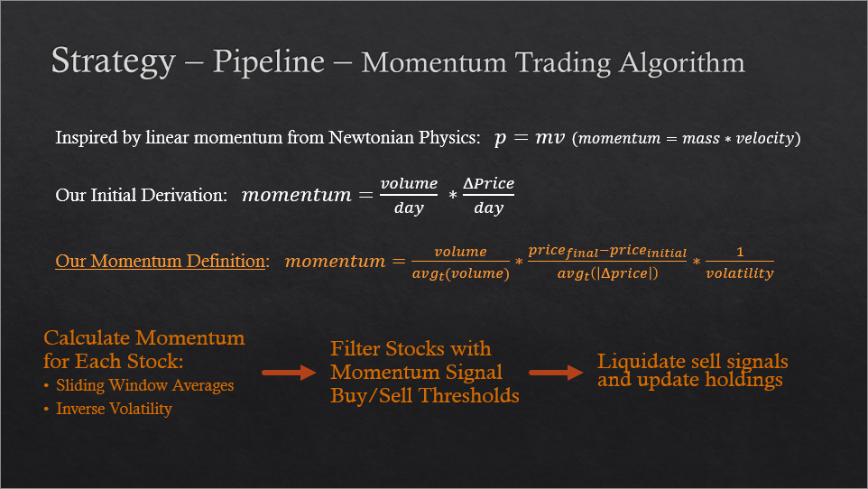

# Momentum Based Trading Algorithm

## Video Presentation on YouTube:

### Stock Selection
First, filter the universe of stocks down to the top 500 stocks by trading volume - trading for at least 10 dollars per share.
Then, segment the stocks that fit into five preferred sectors – dropping stocks from all other sectors.
From each sector, select the top 30 stocks with the highest Free Cash Flow to Price Growth Ratio over a period of the past month to contribute to our diverse basket of 150 stocks.

### Momentum Strategy
